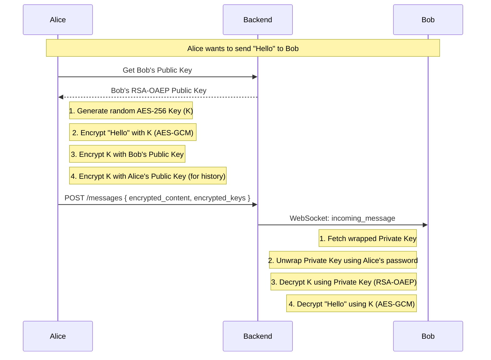

# WhisperBox — End-to-End Encrypted Messaging

WhisperBox is a production-ready, secure messaging application built for **HNG Stage 4B**. It implements strict client-side End-to-End Encryption (E2EE), ensuring that the backend acts only as a blind message store and never sees the plaintext content of messages.

## 🔒 Security Architecture

The application uses the **Web Crypto API** for all cryptographic operations, ensuring high performance and hardware-backed security where available.

### 1. Key Management
- **Asymmetric Encryption**: RSA-OAEP (2048-bit) for secure key exchange.
- **Symmetric Encryption**: AES-GCM (256-bit) for bulk message data.
- **Key Protection**: The user's RSA private key is encrypted (wrapped) on the client before being sent to the server.
- **Key Derivation**: PBKDF2 with SHA-256 is used to derive a "Key Wrapping Key" from the user's password. The raw private key **never leaves the device in plaintext**.

### 2. Encryption Flow (E2EE)



## 🛠️ Tech Stack
- **Core**: React 18, Vite
- **Encryption**: Web Crypto API (Standard browser implementation)
- **Styling**: Tailwind CSS (Premium Dark Mode & Glassmorphism)
- **Communication**: Axios (REST API), Socket.io-client (Real-time)
- **State Management**: React Context API + React Query

## 🚀 Features
- **Zero-Knowledge Architecture**: The server cannot read your messages.
- **Secure Key Generation**: RSA keys are generated locally during registration.
- **Real-Time Delivery**: Instant message updates via WebSockets.
- **Persistent Decrypted Sessions**: Private keys stay in-memory (volatile) and are wiped on logout.
- **Modern UI**: Smooth animations, glass-morphic cards, and intuitive UX.

## 🛡️ Security Guarantees
- ✅ **Confidentiality**: Only the sender and recipient can read the message.
- ✅ **Integrity**: AES-GCM ensures that messages cannot be tampered with in transit.
- ✅ **No Plaintext Storage**: The backend only stores ciphertext and wrapped keys.
- ✅ **Memory Safety**: Decrypted private keys are never stored in `localStorage` or `sessionStorage`.

## 📦 Getting Started

1. Clone the repository
2. Install dependencies: `npm install`
3. Set up `.env`:
   ```env
   VITE_API_BASE_URL=https://hng-stage4b-backend.example.com/api
   VITE_SOCKET_URL=https://hng-stage4b-backend.example.com
   ```
4. Run locally: `npm run dev`
